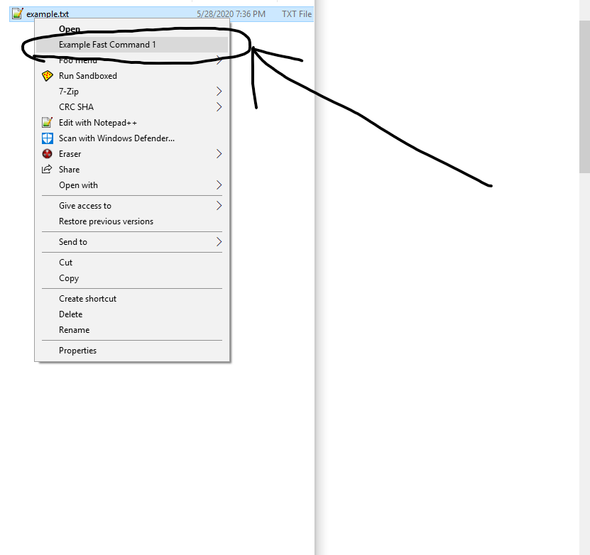

# 💻 context_menu 💻

A Python library to create and deploy cross-platform native context menus.

     

* * *


# Quickstart

1.  Install the library via pip:


    python -m pip install context_menu

2.  Create and compile the menu:

-   You can create items in as little as 3 lines:
    ```python
    from context_menu import menus
    fc = menus.FastCommand('Example Fast Command 1', type='FILES', command='echo Hello')
    fc.compile()
    ```
-   Or you can create much more complicated nested menus:

```Python
        def foo2(filenames):
            print('foo2')
            print(filenames)
            input()

        def foo3(filenames):
            print('foo3')
            print(filenames)
            input()

        if __name__ == '__main__':
            from context_menu import menus

            cm = menus.ContextMenu('Foo menu', type='FILES')
            cm2 = menus.ContextMenu('Foo Menu 2')
            cm3 = menus.ContextMenu('Foo Menu 3')

            cm3.add_items([
                menus.ContextCommand('Foo One', command='echo hello > example.txt'),
            ])
            cm2.add_items([
                menus.ContextCommand('Foo Two', python=foo2),
                cm3,
            ])
            cm.add_items([
                cm2,
                menus.ContextCommand('Foo Three', python=foo3)
            ])

            cm.compile()
```

3.  See the output!

-   First example

    

-   Second example

    

# Detailed Usage

The [ContextMenu](https://context-menu.readthedocs.io/en/latest/context_menu.html#context_menu.menus.ContextMenu) class expects a name, and the activation type if it is the root menu(the first menu). Only compile the root menu.

```Python
ContextMenu(name: str, type: str = None)
```

The [ContextCommand](https://context-menu.readthedocs.io/en/latest/context_menu.html#context_menu.menus.ContextCommand) class expects a name, and either a python function, or a shell command, but not both.

```Python
ContextCommand(name: str, command: str = None, python: function = None)
```

A ContextCommand is the selectable element of a context menu (you can click this part). Python functions can be passed to this method, regardless of their location. *However, the function must accept only one parameter `filenames`, which is a list of paths*, and if the function is in the same file as the menu, you have to surround it with `if __name__ == '__main__':`

Any command passed (as a string) will be directly ran from the shell.

```Python
def foo2(filenames):
    print('foo2')
    print(filenames)
    input()

def foo3(filenames):
    print('foo3')
    print(filenames)
    input()


if __name__ == '__main__':
    from context_menu import menus

    cm = menus.ContextMenu('Foo menu', type='DIRECTORY_BACKGROUND')
    cm.add_items([
        menus.ContextCommand('Foo One', command='echo hello > example.txt'),
        menus.ContextCommand('Foo Two', python=foo2),
        menus.ContextCommand('Foo Three', python=foo3)
    ])
    cm.compile()
```

The [FastCommand](https://context-menu.readthedocs.io/en/latest/context_menu.html#context_menu.menus.FastCommand) class is an extension of the ContextMenu class and allows you to quickly create a single entry menu.

```python
FastCommand(name: str, type: str, command: str = None, python: function = None)
```

It expects a name, type, and command/function.

```python
def foo1(filenames):
    print(filenames)
    input()

if __name__ == '__main__':
    from context_menu import menus

    fc = menus.FastCommand('Example Fast Command 1', type='FILES', python=foo1)
    fc.compile()
```

You can use the [{MENU}.add_items{ITEMS}](https://context-menu.readthedocs.io/en/latest/context_menu.html#context_menu.menus.ContextMenu.add_items) function to add these elements together. Menus can be added to menus, creating cascading context menus. You have to call [{MENU}.compile()](https://context-menu.readthedocs.io/en/latest/context_menu.html#context_menu.menus.ContextMenu.compile) in order to create the menu. Admin privileges are required on windows, as it modifies the Registry. The code will automatically prompt for Admin rights if it is not sufficiently elevated.


You can remove a menu easily as well. Simply call the ['menus.removeMenu()']() method.

```python
removeMenu(name: str, type: str)
```

For example, if I wanted to remove the menu 'Foo Menu' that activated on type 'FILES':
```python
from context_menu import menus

menus.removeMenu('Foo Menu', 'FILES')
```
---
Check out the [examples folder](examples) for more complicated examples.


# Types

There are different locations where a context menu can fire (if you right click on a folder you'll get different options then if you right click on a file).  The `type` variable controls this behavior in the library, and you can reference this table to determine the `type`:

| Name                 | Location                                        | Action                                   |
| -------------------- | ----------------------------------------------- | ---------------------------------------- |
| FILES                | HKEY_CLASSES_ROOT\*\\shell\\                    | Opens on a file                          |
| DIRECTORY            | HKEY_CLASSES_ROOT\\Directory\\shell             | Opens on a directory                     |
| DIRECTORY_BACKGROUND | HKEY_CLASSES_ROOT\\Directory\\Background\\shell | Opens on the background of the Directory |
| DESKTOP_BACKGROUND   | HKEY_CLASSES_ROOT\\DesktopBackground\\Shell     | Opens on the background of the Desktop   |
| DRIVE                | HKEY_CLASSES_ROOT\\Drive\\shell                 | Opens on the drives(think USBs)          |

# Important notes

-   The code can sometimes be really weird when it comes to admin rights on Windows. The `compile()` method will automatically prompt for admin rights if required, but this can cause issues sometimes.

-   Almost all of the errors I've encountered in testing were when the code and the functions were in the same file. You should make a separate file for the code or surround it with `if __name__ == '__main__':`.

Feel free to check out a [file sorter](https://github.com/saleguas/freshen) I made that implements very complex usage of this library.

You can check out the official documentation [here](https://context-menu.readthedocs.io/en/latest/index.html).
