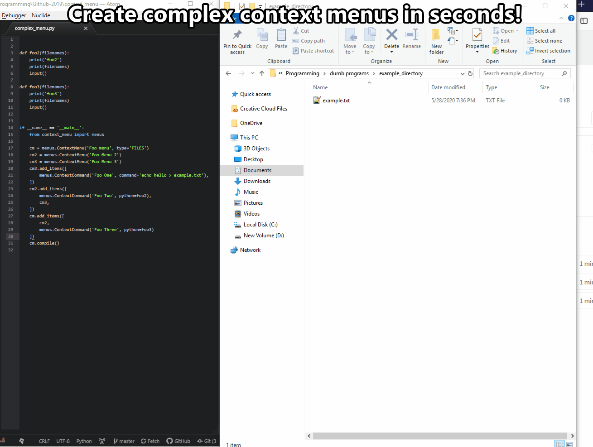
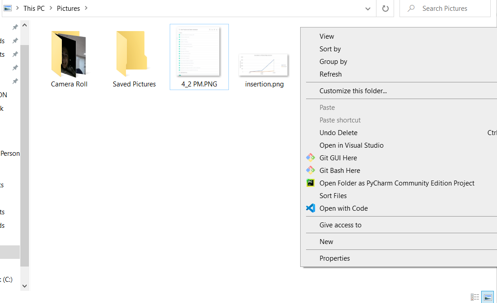
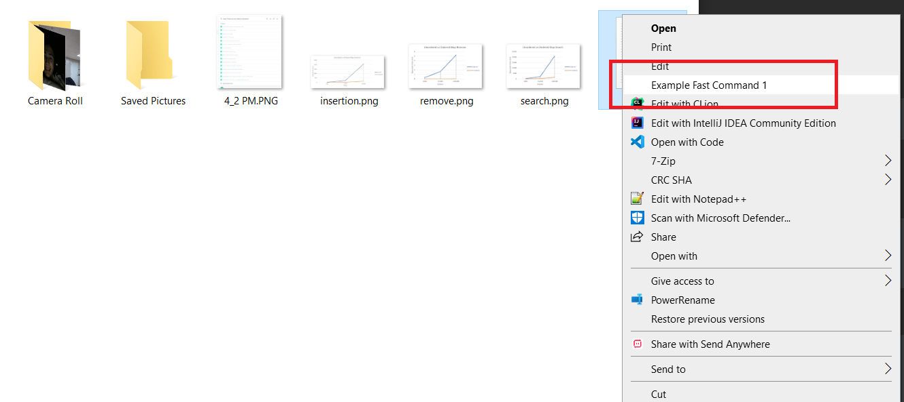
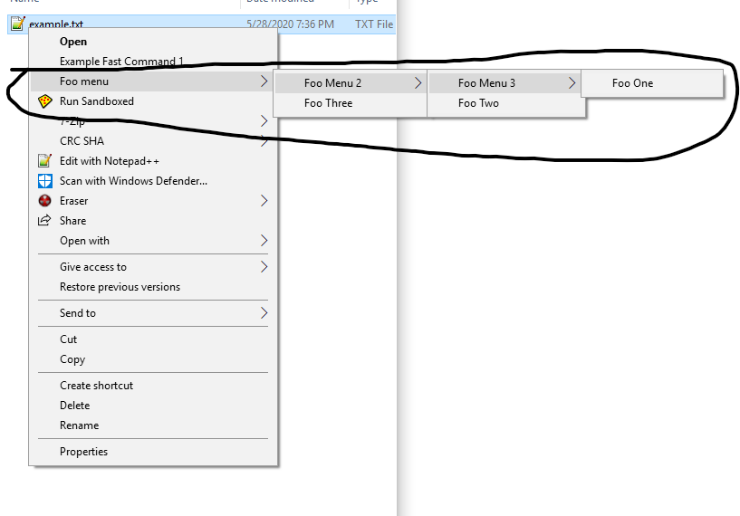

# 🗂️[context_menu](https://github.com/saleguas/context_menu) [](https://github.com/saleguas/context_menu/actions/workflows/ci.yml)   [](https://context-menu.readthedocs.io/en/latest/)  [](https://pepy.tech/project/context-menu)


💻 A Python library to create and deploy cross-platform native context menus. 💻


Documentation available at: https://context-menu.readthedocs.io/en/latest/

* * *



* * *

# Table of Contents
- [⚙ Features ⚙](#-features-)
  * [🙋 What is the context menu? 🙋](#-what-is-the-context-menu-)
  * [🖥️ What Operating Systems are supported? 🖥️](#%EF%B8%8F-what-operating-systems-are-supported-%EF%B8%8F)
  * [🐍 What Python versions are supported? 🐍](#-what-python-versions-are-supported-)
- [💽 Installation 💽](#-installation-)
- [🕹️ Quickstart 🕹️](#%EF%B8%8F-quickstart-%EF%B8%8F)
- [🤖 Advanced Usage 🤖](#-advanced-usage-)
  * [The `ContextMenu` Class](#the-contextmenu-class)
  * [The `ContextCommand` Class](#the-contextcommand-class)
  * [The `FastCommand` Class](#the-fastcommand-class)
  * [The `removeMenu` method](#the-removemenu-method)
  * [The `params` Command Parameter](#the-params-command-parameter)
  * [`command_vars` Command Parameter](#command_vars-command-parameter)
  * [Opening on Files](#opening-on-files)
  * [Activation Types](#activation-types)
- [🏁 Goals 🏁](#-goals-)
- [🙌 Contribution 🙌](#-contribution-)
- [📓 Important notes 📓](#-important-notes-)
- [💻 Freshen - A context_menu project! 💻](#-freshen---a-context_menu-project-)
- [💙 Support 💙](#-support-)

# ⚙ Features ⚙
This library lets you edit the entries on the right click menu for Windows and Linux using pure Python. It also allows you to make cascading context menus!

context_menu was created as due to the lack of an intuitive and easy to use cross-platform context menu library. The
library allows you to create your own context menu entries and control their behavior seamlessly in native Python. The
library has the following features:

* Written in pure python with no other dependencies
* Extremely intuitive design inspired by Keras Tensorflow
* Swift installation from Python's Package Manager (pip)
* Painless context menu creation
* Cascading context menu support
* The ability to natively integrate python functions from a context entry call
* Detailed documentation

## 🙋 What is the context menu? 🙋

The context menu is the window that is displayed when you right click:



The context menu is different depending on what was right clicked. For example, right clicking a folder will give you
different options than right clicking a file.

## 🖥️ What Operating Systems are supported? 🖥️ 

Currently, the only operating systems supported are:

- Windows 7
- Windows 10
- Windows 11
- Linux (Using Nautilus)

## 🐍 What Python versions are supported? 🐍

**All python versions 3.7 and above** are supported.

# 💽 Installation 💽

If you haven't installed Python, download and run an installer from the official
website: https://www.python.org/downloads/

Once you have Python, the rest is super simple. Simply just run the following command in a terminal to install the
package:

```commandline
python -m pip install context_menu
```

or if you're on Linux:

```commandline
python3 -m pip install context_menu
```

_Note: If you're on Windows and it says the command isn't recognized, make sure to
add [Python to your path](https://datatofish.com/add-python-to-windows-path/) and run the command prompt as
administrator_

# 🕹️ Quickstart 🕹️

Let's say you want to make a basic context menu entry when you right click a file.

1. If you haven't already Install the library via pip:

```commandline
python -m pip install context_menu
```

2. Create and compile the menu:

It's super easy!
You can create entries in as little as 3 lines:

```python
from context_menu import menus

fc = menus.FastCommand('Example Fast Command 1', type='FILES', command='echo Hello')
fc.compile()
```



> **Note:** On Windows, the command `echo Hello` may not work as expected because `echo` is a built-in command of the cmd shell. To execute such commands on Windows, you need to prefix them with `cmd /c`. So the command becomes:
> 
> ```python
> fc = menus.FastCommand('Example Fast Command 1', type='FILES', command='cmd /c echo Hello')
> ```
> 
> This ensures that the command is run within the cmd shell.

All you have to do is import the library and define the type of context entry you want. The options are:

* A context menu (an entry that has more entries)
* A fast command (a single context menu entry to kick a running script)
* A context command which can be added to menus for more complex commands

You can also create much more complicated nested menus:

```Python
def foo2(filenames, params):
    print('foo2')
    print(filenames)
    input()


def foo3(filenames, params):
    print('foo3')
    print(filenames)
    input()


if __name__ == '__main__':
    from context_menu import menus

    cm = menus.ContextMenu('Foo menu', type='FILES')
    cm2 = menus.ContextMenu('Foo Menu 2')
    cm3 = menus.ContextMenu('Foo Menu 3')

    cm3.add_items([
        menus.ContextCommand('Foo One', command='echo hello > example.txt'),
    ])
    cm2.add_items([
        menus.ContextCommand('Foo Two', python=foo2),
        cm3,
    ])
    cm.add_items([
        cm2,
        menus.ContextCommand('Foo Three', python=foo3)
    ])

    cm.compile()
```



All context menus are **permanent** unless you remove them.

# 🤖 Advanced Usage 🤖

## The `ContextMenu` Class

The [ContextMenu](https://context-menu.readthedocs.io/en/latest/context_menu.html#context_menu.menus.ContextMenu) object
holds other context objects. It expects a name, **the activation type** if it is the root menu(the first menu), and an optional icon path. Only
compile the root menu.

```Python
ContextMenu(name: str, type: str = None, icon_path: str = None)
```

Menus can be added to menus, creating cascading context menus. You can use
the [{MENU}.add_items{ITEMS}](https://context-menu.readthedocs.io/en/latest/context_menu.html#context_menu.menus.ContextMenu.add_items)
function to add context elements together, for example:

```Python
cm = menus.ContextMenu('Foo menu', type='DIRECTORY_BACKGROUND')
cm.add_items([
    menus.ContextMenu(...),
    menus.ContextCommand(...),
    menus.ContextCommand(...)
])
cm.compile()
```

You have to
call [{MENU}.compile()](https://context-menu.readthedocs.io/en/latest/context_menu.html#context_menu.menus.ContextMenu.compile)
in order to create the menu.

## The `ContextCommand` Class

The [ContextCommand](https://context-menu.readthedocs.io/en/latest/context_menu.html#context_menu.menus.ContextCommand)
class creates the selectable part of the menu (you can click it). It requires a name, and either a Python function or a
command **(but NOT both)** and has various other options

```Python
ContextCommand(name: str, command: str = None, python: 'function' = None, params: str = None, command_vars: list = None, icon_path: str = None)
```

Python functions can be passed to this method, regardless of their location. **However, the function must accept only
two parameters `filenames`, which is a list of paths\*, and `params`, the parameters passed to the function**. and if
the function is in the same file as the menu, you have to surround it with `if __name__ == '__main__':`

```python
# An example of a valid function
def valid_function(filenames, params):
    print('Im valid!')
    print(filenames)
    print(params)


# Examples of invalid functions
def invalid_function_1(filenames, param1, param2):
    print('Im invalid!')
    print(filenames)


def invalid_function_2(params):
    print('Im invalid!')
    print(params)
```

Any command passed (as a string) will be directly ran from the shell.

## The `FastCommand` Class

The [FastCommand](https://context-menu.readthedocs.io/en/latest/context_menu.html#context_menu.menus.FastCommand) class
is an extension of the ContextMenu class and allows you to quickly create a single entry menu. It expects a name, type,
command/function and an optional icon path.

```python
FastCommand(
    name: str, type: str, command: str = None, python: 'function' = None, params: str = '', command_vars: list = None, icon_path: str = None)
```

```python
def foo1(filenames, params):
    print(filenames)
    input()


if __name__ == '__main__':
    from context_menu import menus

    fc = menus.FastCommand('Example Fast Command 1', type='FILES', python=foo1)
    fc.compile()
```

## The `removeMenu` method

You can remove a context menu entry easily as well. Simply call the ['menus.removeMenu()'](<>) method.

```python
removeMenu(name: str, type: str)
```

For example, if I wanted to remove the menu 'Foo Menu' that activated on type 'FILES':

```python
from context_menu import menus

menus.removeMenu('Foo Menu', 'FILES')
```

and boom! It's gone 😎

## The `params` Command Parameter

In both the `ContextCommand` class and `FastCommand` class you can pass in a parameter, defined by the `parameter=None`
variable. **This value MUST be a string!** This means instead of passing a list or numbers, pass it as a string
separated by spaces or whatever to delimitate it.

```Python
fc = menus.FastCommand('Example Fast Command 1', type='FILES', python=foo1, params='a b c d e')
fc.compile()
```

For more information, [see this.](https://github.com/saleguas/context_menu/issues/4)

Works on the `FastCommand` and `ContextCommand` class.

## `command_vars` Command Parameter

If you decide to pass a shell command, you can access a list of special variables. For example, if I wanted to run a
custom command with the file selected, I could use the following:

```Python
fc = menus.FastCommand('Weird Copy', type='FILES', command='touch ?x', command_vars=['FILENAME'])
fc.compile()
```

which would create a new file with the name of whatever I selected with an 'x' on the end. The `?` variable is
interpreted from left to right and replaced with the selected
values [(see this)](https://github.com/saleguas/context_menu/issues/3).

All of the preset values are as follows:

| Name          | Function                                |
| ------------- | --------------------------------------- |
| FILENAME      | The path to the file selected           |
| DIR/DIRECTORY | The directory the script was ran in.    |
| PYTHONLOC     | The location of the python interpreter. |

Works on the `FastCommand` and `ContextCommand` class.

## Opening on Files

Let's say you only want your context menu entry to open on a certain type of file, such as a `.txt` file. You can do
this by adding a `type` variable to the `ContextCommand` or `FastCommand` class.

```Python
fc = menus.FastCommand('Weird Copy', type='.txt', command='touch ?x',
                       command_vars=['FILENAME'])  # opens only on .txt files
fc.compile()
```

Now you'll only see the "Weird Copy" menu entry when you right click a .txt file.

## Activation Types

There are different locations where a context menu can fire. For example, if you right click on a folder you'll get
different options than if you right click on a file. The `type` variable controls this behavior in the library, and you
can reference this table to determine the `type`:

| Name                 | Location                                                           | Action                                   |
| -------------------- | ------------------------------------------------------------------ | ---------------------------------------- |
| FILES                | HKEY_CURRENT_USER\\Software\\Classes\\\*\\shell\\                  | Opens on a file                          |
| DIRECTORY            | HKEY_CURRENT_USER\\Software\\Classes\\Directory\\shell             | Opens on a directory                     |
| DIRECTORY_BACKGROUND | HKEY_CURRENT_USER\\Software\\Classes\\Directory\\Background\\shell | Opens on the background of the Directory |
| DRIVE                | HKEY_CURRENT_USER\\Software\\Classes\\Drive\\shell                 | Opens on the drives(think USBs)          |
| DESKTOP              | Software\\Classes\\DesktopBackground\\shell                        | Opens on the background of the desktop   |

* * *

I strongly recommend checking out the [examples folder](examples) for more complicated examples and usage.

You can check out the official documentation [here](https://context-menu.readthedocs.io/en/latest/index.html).


* * *

# 🏁 Goals 🏁

This project tackles some pretty big issues, and there's definetly some goals that I'd like to accomplish. The current roadmap is as follows:

* Support for other Linux distributions
* Better approach to the Linux GNOME integration
* Mac support
* Bypass 16 entry limit on windows

If by all means you want to help reach these milestones, see contribution below.

# 🙌 Contribution 🙌

**I _really_ want to add support for MacOS, but I don't have the experience required to implement it.**

Contributing is super simple! Create an additional branch and make a pull request with your changes. If the changes past the automated tests, it will be manually reviewed and merged accordingly.

Any and all help is appreciated, and if you have any questions, feel free to contact me directly.

# 📓 Important notes 📓

- Almost all the errors I've encountered in testing were when the code and the functions were in the same file. You
  should make a separate file for the code or surround it with `if __name__ == '__main__':`.
- On windows, there's currently a 16 entry limit on the context menu.

# 💻 Freshen - A context_menu project! 💻

Feel free to check out a [file sorter](https://github.com/saleguas/freshen) program I made that directly implements this library.

[](https://github.com/saleguas/freshen)

# 💙 Support 💙

All my work is and always will be free and open source. If you'd like to support me, **please consider leaving a ⭐ star ⭐**, as it motivates me and the community to keep working on this project.

Thanks for reading!

